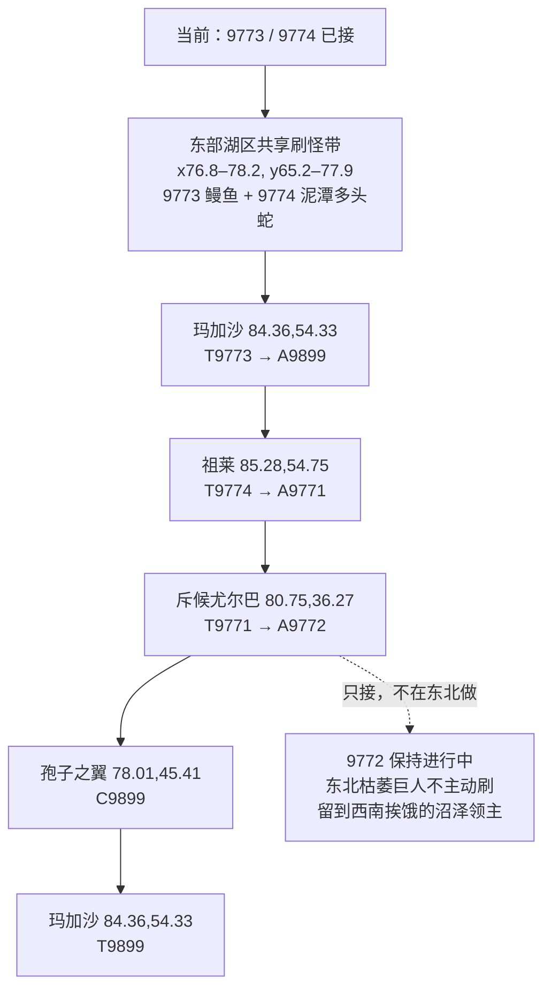

# 赞加沼泽 R1：东北死亡泥潭第一条稳定路线（候选 v1）

日期：2026-08-14
状态：第一条增量路线候选，待用户实跑/确认后冻结
依据：`2026-08-14-route-atlas-cluster-incremental-insertion-method.md`

## 1. 本轮目的

只构造第一条可审计路线 R1，不把后续所有目标簇一次性混进来。

第一空间块选择：东北死亡泥潭 / 孢子之翼固定点。

本轮真正希望完成的主体动作：

- 解锁并进入 9771《寻找斥候尤尔巴》；
- 在死亡泥潭找到尤尔巴并接 9772《尤尔巴的报告》；
- 完成 9899《未完的职责》：击杀孢子之翼；
- 9772 只在本轮接取，不在东北强做。

为做到这一点，必须先插入两个当前已接任务的前置动作：

- 9773《别再提蘑菇了！》→ 解锁 9899；
- 9774《厚重多头蛇鳞片》→ 解锁 9771。

这两个前置任务虽然不属于“孢子之翼/死亡泥潭”同一目标簇，但存在显式前置，因此允许并且必须插到 R1 前段。

## 2. 当前状态

根据用户 2026-08-14 截图：

- 9773《别再提蘑菇了！》：已接未做；
- 9774《厚重多头蛇鳞片》：已接未做；
- 9899《未完的职责》：未接，直接前置 9773；
- 9771《寻找斥候尤尔巴》：未接，直接前置 9774；
- 9772《尤尔巴的报告》：未接，直接前置 9771。

## 3. 真实 A / C / T 点

### 9773《别再提蘑菇了！》
- A/T：玛加沙 `(84.36,54.33)`。
- C：暗泽鳗鱼，东部水域大量真实刷新。
- 与 9774 最强人工重合刷怪带：约 `x76.8–78.2, y65.2–77.9`。
- 真实鳗鱼例点：`(77.38,68.20)`, `(77.43,69.02)`, `(76.91,71.25)`, `(77.39,72.21)`, `(77.35,76.22)`。

### 9774《厚重多头蛇鳞片》
- A/T：祖莱 `(85.28,54.75)`。
- C 可由多类多头蛇掉落。
- 为与 9773 同趟完成，本轮选择泥潭多头蛇的东部水域实例，不去中部泥爪/穆拉格什区。
- 与鳗鱼重合的真实多头蛇例点：`(77.81,66.49)`, `(77.95,68.30)`, `(77.92,70.34)`, `(77.87,72.32)`, `(77.90,76.21)`, `(78.19,77.95)`。

### 9899《未完的职责》
- A/T：玛加沙 `(84.36,54.33)`。
- 前置：9773。
- C：孢子之翼固定点 `(78.01,45.41)`。

### 9771《寻找斥候尤尔巴》
- A：祖莱 `(85.28,54.75)`。
- 前置：9774。
- T：斥候尤尔巴 `(80.75,36.27)`。
- 本任务本质为找到 NPC 后交任务，没有独立刷怪动作。

### 9772《尤尔巴的报告》
- A：斥候尤尔巴 `(80.75,36.27)`。
- T：祖莱 `(85.28,54.75)`。
- 前置：9771。
- 报告可由两类怪掉落：
  - 枯萎的巨人（东北）：模型期望约 50 杀；
  - 挨饿的沼泽领主（西南）：模型期望约 5 杀。
- 因此本轮在死亡泥潭**只接 9772，不为它专门刷东北枯萎巨人**。后续进入西南孢殖林时再用高掉率来源完成。

这一条是本 R1 最重要的动作判断：

> “目标在当前空间块出现”不等于“现在应该做”。位置关系不能覆盖服务成本事实。

## 4. R1 主路线

完整复用版本：

```text
A9773 玛加沙 84.36,54.33
  ↓
A9774 祖莱 85.28,54.75
  ↓
C9773 + C9774
东部湖区共享刷怪带 x76.8–78.2, y65.2–77.9
鳗鱼 + 泥潭多头蛇同时处理，直到两个任务都完成
  ↓
T9773 玛加沙 84.36,54.33
  ↓ 同 NPC 立即
A9899 玛加沙 84.36,54.33
  ↓
T9774 祖莱 85.28,54.75
  ↓ 同 NPC 立即
A9771 祖莱 85.28,54.75
  ↓
T9771 斥候尤尔巴 80.75,36.27
  ↓ 同 NPC 立即
A9772 斥候尤尔巴 80.75,36.27
  ↓
C9899 孢子之翼 78.01,45.41
  ↓
T9899 玛加沙 84.36,54.33
```

9772 保持已接状态，不在 R1 内完成/交付。

## 5. 当前实跑版

因为用户当前已经完成 A9773 与 A9774，所以当前实际从这里开始：

```text
【当前起点：东部岗哨附近】
  ↓
① 东部湖区共享刷怪带
   9773 暗泽鳗鱼
   9774 泥潭多头蛇
   两个任务一起做到完成
  ↓
② 玛加沙 84.36,54.33
   交 9773
   立即接 9899
  ↓
③ 祖莱 85.28,54.75
   交 9774
   立即接 9771
  ↓
④ 斥候尤尔巴 80.75,36.27
   交 9771
   立即接 9772
  ↓
⑤ 孢子之翼 78.01,45.41
   完成 9899
   不刷 9772 的枯萎巨人
  ↓
⑥ 玛加沙 84.36,54.33
   交 9899
```

## 6. Mermaid 结构图



## 7. 为什么这个 R1 比旧动作序列更合理

旧序列曾经：

- 9773 在 `(75.47,70.28)` 单独做；
- 9774 在 `(70.82,65.25)` 单独做；
- 9771/9899 很晚才进入死亡泥潭；
- 9772 又被派去西南后再返回东部。

R1 改成：

1. 利用真实刷新点确认 9773/9774 在东部水域有强重合带，一次局部刷怪完成两个前置；
2. 一次回岗哨同时完成两组 `T→A` 解锁；
3. 只进入死亡泥潭一次完成 `T9771→A9772 + C9899`；
4. 9772 虽然东北有合法怪源，但因掉率明显差，不让它驱动东北刷怪；
5. 后续西南路线自然处理 9772，再顺路回祖莱交付。

## 8. R1 冻结条件

本候选可以冻结为第一条稳定路线，前提是用户确认：

- 当前 9773/9774 的东部湖区刷法在游戏内地形上可顺畅同时进行；
- 从岗哨去尤尔巴再南下孢子之翼的实际通路没有特殊地形阻碍；
- 实跑没有出现 Questie 数据外的机制要求。

冻结后，第二目标簇只允许把新的 A/C/T 局部插入 R1，不重新整体洗牌，除非发现明确前置/地形/重复刷怪错误。
